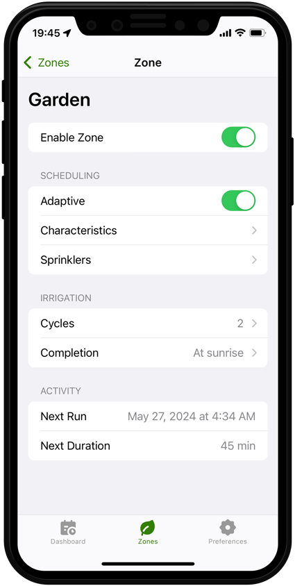

<span align="center">

<br>


# Smart irrigation for Homebridge

[](https://github.com/maxgrafik/homebridge-sprinklers)

</span>

## Description



This [Homebridge](https://homebridge.io) plugin exposes a multi-zone irrigation system to Apple’s HomeKit.

It uses current weather forecasts and crop [evapotranspiration](https://en.wikipedia.org/wiki/Evapotranspiration) estimation with the [FAO-56](https://www.fao.org/4/X0490E/x0490e00.htm) method to provide smart scheduling for your irrigation hardware.

Automate your watering schedule based on temperature, humidity and precipitation levels, ensuring your plants receive the right amount of water.

All crop and soil characteristics, irrigation hardware details and scheduling settings can be configured on the fly through a web app.

#### Note

The plugin itself **does not** control any physical hardware. It’s up to you to create automations triggered by the state of the irrigation system (or exposed sensors) to switch on/off e.g. a smart outlet for your pump, HomeKit controlled valves etc.

<br clear="both">

## Configuration

I recommend using Homebridge UI to configure the plugin

```
"platforms": [
    ...
    {
        "platform": "Sprinklers"
        "zones": [
            {
                "zoneName": <zone_name>,
                "exposeSensor": <true|false>
            },
            ...
        ],
        "latitude": <-90...90>,
        "longitude": <-180...180>,
        "server": <true|false>,
        "serverPort": 9000,
        "serverPassword": <password>
    }
]
```

Option | Description
------ | -----------
**zones** | Array of zones
**zoneName** | Name of the zone
**exposeSensor** | Expose contact sensor for this zone<sup>1</sup>
**latitude** | Location coordinates for weather forecast<sup>2</sup>
**longitude** | Location coordinates for weather forecast<sup>2</sup>
**server** | Run web app server
**serverPort** | Server port
**serverPassword** | Set the password required to log into the web app. Leaving this blank disables password protection.

<sup>1</sup> Apple’s Home app does not allow you to create automations based on the state of an irrigation system or its valves. Exposing a sensor for a zone lets you bind automations to the open/close state of the sensor.

<sup>2</sup> Using the open-source weather API from [Open-Meteo.com](https://open-meteo.com) which offers free access for non-commercial use. No API key required.
